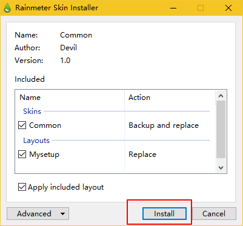
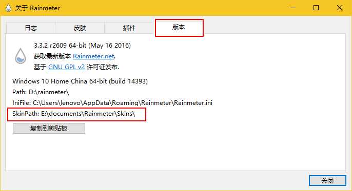
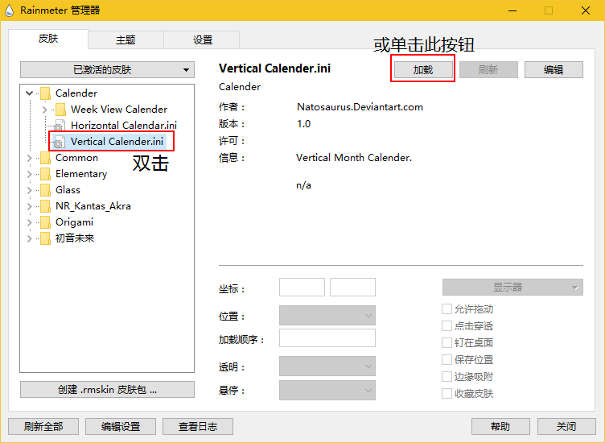
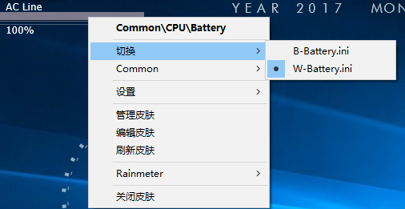
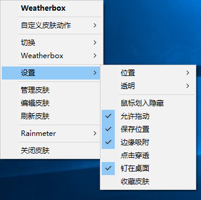
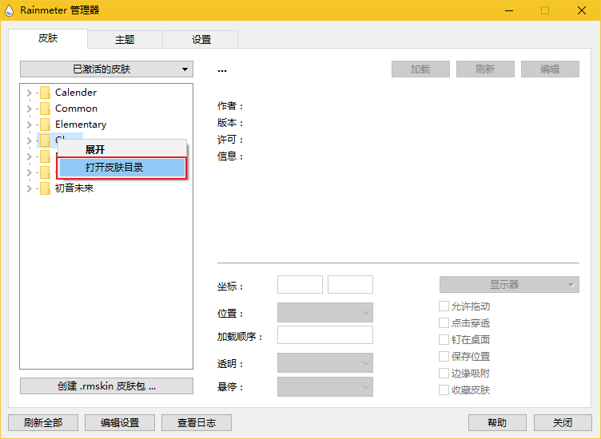
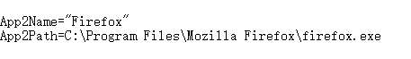

## [萨满喵喵 ヽ(￣ω￣(￣ω￣〃)](https://emlvirus.github.io/)

<h2 align="center">Rainmeter 教程基础版</h2>

  

本教程适用环境

OS Windows 7/8.1/10

Rainmeter版本 4.x

本教程会随着Rainmeter版本号更新而更新，请在阅读前认真核对教程适用环境

<h2 align="center">FAQs 常见问题</h2>

Q1：Rainmeter对系统资源占用如何（使用Rainmeter会卡电脑吗）？

A1：CPU占用率取决于Rainmeter已激活皮肤的数量及已激活皮肤的刷新频率，一般而言，类似于频谱、舞蹈人物等实时刷新皮肤若刷新率较高且数量较多，CPU占用将明显偏高（稍后将详细讲解降低占用的办法，见于调整皮肤刷新率部分）；

RAM占用一般极少，可忽略不计，对于大部分用户这个数值不多于70M；

此外，正常情况下不出现明显磁盘读取、I/O读取等占用。

（一句题外话，运行中完全不占用系统资源的软件目前理论上不存在。）

Q2：我需要怎样的知识水平才能使用Rainmeter（Rainmeter上手难度高吗）？

A2：如果你只用下载并安装在互联网上分享的皮肤、插件等，那么是不需要任何专业知识的；但是自行制作皮肤、插件等将要求一定开发知识。

~~（连基本电脑操作基础都不懂的话请无视）~~

Q3：Rainmeter 4.x系统兼容如何？

A3：Windows 7及更新 不支持XP 不支持XP 不支持XP

（题外话：停止支持的OS还是放弃吧。习惯？怀旧？嗯 ~~反正主流开发者们觉得这就是\*\*的扯淡）

此外若使用Windows 7时无法安装，那么安装如下系统补丁

[https://www.microsoft.com/zh-CN/download/details.aspx?id=36805](https://www.microsoft.com/zh-CN/download/details.aspx?id=36805)

<h2 align="center">Concepts 概念解释</h2>

皮肤skin：Rainmeter显示于桌面的可视化组件，文件格式为ini；
例如播放器皮肤可以在绑定的播放器运行时控制播放器

插件plugin：赋予Rainmeter一定功能的动态链接库文件，文件格式为dll；
例如nowplaying.dll插件为雨滴提供运行的播放器播放的音频信息

主题layout：当前的皮肤激活情况、皮肤布局（可以包括壁纸）的组合方案

<h2 align="center">Install Skins 安装皮肤</h2>

在软件初次安装时会连带安装激活一些内置皮肤（仅英文），如不需要右键关闭即可

#### 安装rmskin皮肤包

1.安装rmskin皮肤包时，若已经安装Rainmeter，那么双击该皮肤包文件，点击Install按钮（如下图）

2.此时在Rainmeter管理视窗中即可看到安装的皮肤，并且一般情况下，皮肤包内所有皮肤都会被激活（使用自定义主题时另作别论）

_注意：当安装Rainmeter如果选择便携安装，上述操作将无法执行（未写入注册表信息），此时若希望安装此类皮肤请重新运行安装程序并选择标准安装_

#### 安装rar压缩包皮肤

1.首先找到Rainmeter皮肤安装路径：右键单击Rainmeter托盘图标，点击关于 ，在`版本` 选项卡中的`SkinPath`后描述的路径即为皮肤安装路径（如下图）

2.然后将rar压缩包中的皮肤解压到皮肤安装路径

3.右键单击Rainmeter托盘图标，点击`刷新全部`

4.此时在Rainmeter管理视窗中即可看到相应皮肤，双击一个ini皮肤即可激活，或选中后点击右侧的`加载`按钮 （如下图）

<h2 align="center">Context Menu 右键菜单</h2>

Rainmeter皮肤右键菜单中包含的操作见下：

#### 其中

切换可以切换当前皮肤包含的变形，可以是大小，旋转等变形（因为皮肤不像窗口，可以随意变形）；

因此当你发现皮肤过大，此处没有提供变形选择，皮肤中也没有提供直接的参数，那么你需要调整皮肤大小就必须自行重写整个皮肤

切换的下一个菜单会显示来自同一个rmskin皮肤包的其他皮肤，可进行快速加载切换

#### 设置菜单提供皮肤详细设置

位置设置选择输出的显示器（适用于多显示器接入）及与桌面图标文件的相对位置；透明设置透明度

需要注意一点：勾选 点击穿透 即意味皮肤无法被点选，因此dock类皮肤（相当于快捷方式）会因此失效，勾选后希望取消需从管理器窗口进行
简单逻辑问题，想不懂我还能说啥？

Rainmeter菜单提供一些全局选项，等效于管理器窗口操作

<h2 align="center">Skin Websites 皮肤网站</h2>

几个找皮肤的网站，按资源数量排序，由多到少分别是

1. Deviant Art（本人搬运皮肤主要去处）
2. [官方论坛](https://forum.rainmeter.net)
3. 雨滴中国论坛（需注册 淘宝买邀请码）
4. [customize.org](http://customize.org/rainmeter)
5. 百度贴吧
6. Github

<h2 align="center">Edit Skins 编辑参数</h2>

不管编辑什么，请使用英文标点（半角字符），**修改后均需要刷新才生效**

#### 修改皮肤变量

##### 首先你必须知道这个皮肤（系列）是否有公用变量库文件

右键单击皮肤，点击 编辑皮肤 ，如果你看到了以下代码或者类似的变量引用代码，则说明存在公用变量文件：

`@include=\#@\#Variables.inc`

`@IncludeVars="\#@\#Settings.txt"`

公用变量文件即为代码最后的文件名，修改皮肤变量时必须找到这一文件，这一文件位于你的皮肤安装目录的对应皮肤文件夹的根目录下：在Rainmeter管理视窗中右键皮肤文件，点击 打开皮肤目录即可 （如下图）

若你没有看到相关代码（即确定该皮肤（系列）未使用公用变量库文件），那么直接右键皮肤，选择 编辑，修改打开的ini文件即可

#### 编辑dock类皮肤

Dock类皮肤类似于快捷方式，可以快速访问指定文件或文件夹

编辑此类皮肤参数时只需要编辑名称路径即可

名称修改Name等号后面的字符即可（有时带引号，先看皮肤情况即可）

路径修改Path等号后面的路径即可（一定不要带引号）

注意从快捷方式找程序路径时不要带双引号，注意复制目标不是起始位置

这两个变量总是成对出现，请注意对应

有些旧皮肤以`LeftMouseUpAction=!Execute[" "]`这句代码作为Path路径表示，两个引号的中间部分就是应该修改替换路径的地方

例如

此外有些皮肤没有名称，此类皮肤修改路径即可（使用前请思考之后会不会忘记每个dock对应的是什么 ~~忘记了怪我咯~~）

#### 此处给出一些比较便捷的路径，复制粘贴到`Path`等号后即可

`::{20D04FE0-3AEA-1069-A2D8-08002B30309D}` 我的电脑

`%WINDIR%\system32\control.exe` 控制面板

`::{992CFFA0-F557-101A-88EC-00DD010CCC48}` 拨号网络

`%WINDIR%\System32\ncpa.cpl` 查看网络连接

`::{208D2C60-3AEA-1069-A2D7-08002B30309D}` 网上邻居

`::{645FF040-5081-101B-9F08-00AA002F954E}` 回收站

`::{450D8FBA-AD25-11D0-98A8-0800361B1103}` 我的文档

关机 `%windir%\System32\shutdown -s`

重启 `%windir%\System32\shutdown -r`

注销 `%windir%\System32\shutdown -l`

#### 编辑播放器

编辑播放器需要修改播放器皮肤中的播放名与播放器主程序路径即可

播放器主程序路径从快捷方式中找到注意复制目标不是起始位置

有些皮肤不需要指定播放器路径

修改名称时修改`PlayerName`后字符即可，名称见下：

AIMP写为： AIMP

foobar2000写为：CAD

iTunes写为：iTunes

Winamp写为：winamp

Windows Media Player写为：WMP

其它写为：WLM

国外播放器都支持专辑封面、歌曲评级、歌曲进度、歌曲时长。

国产播放器因为没有支持的接口，所以只能控制暂停播放及上曲、下曲。

#### 编辑相册

找到`Picture`或者`PathName`，替换等号后路径即可；如希望显示单一图片则输入带图片文件名的路径即可

#### 编辑天气

此处不作多讲，搜索出对应天气网站，查找你的城市，然后找到网址中类似代码替换即可。有些新皮肤会自动查找定位。

皮肤提供者均会说明皮肤网站类型 ~~不知道怪我咯~~

注意：

### 最近weather.com跟Yahoo weather更新了网站数据API

如有这两种天气皮肤失效的尝试如下解决办法：

weather.com

找到皮肤INI的URL 例如

`URL=http://xml.weather.com/weather/local/\#Location\#?cc=\*&unit=\#Unit\#&dayf=1`

将 `http://xml.weather.com/weather/local` 替换为 `http://wxdata.weather.com/wxdata/weather/local`

Yahoo weather

找到皮肤INI的URL 例如

`URL=http://weather.yahooapis.com/forecastrss?w=\#LocationCode\#&u=\#Unit\#`

将 `http://weather.yahooapis.com` 替换为 `http://xml.weather.yahoo.com`

#### 中国天气网

由于中国天气网weather.com.cn已关闭数据接口 因此遇到此网站天气皮肤请直接删除

另外请将其与weather.com（仍然正常）相区别

### LICENSE
 Except where otherwise noted, all contents in this site is licensed under the <a rel="license" href="http://creativecommons.org/licenses/by-nc-sa/4.0/">CC BY-NC-SA 4.0 International License</a>.
